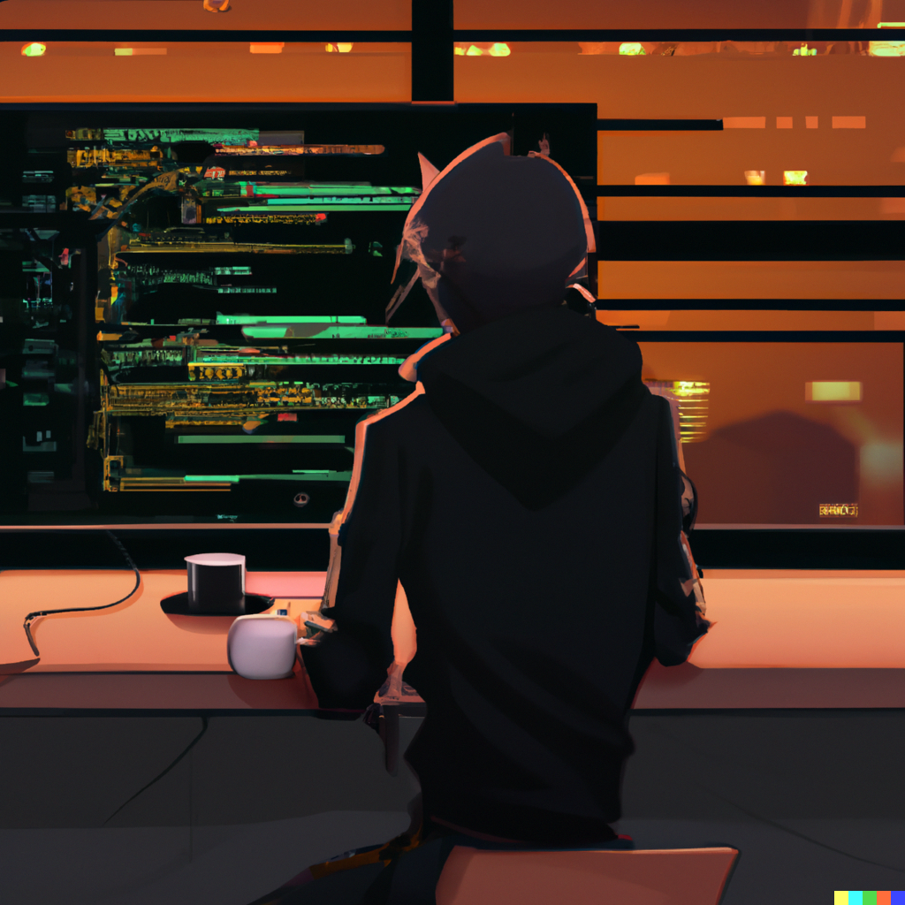
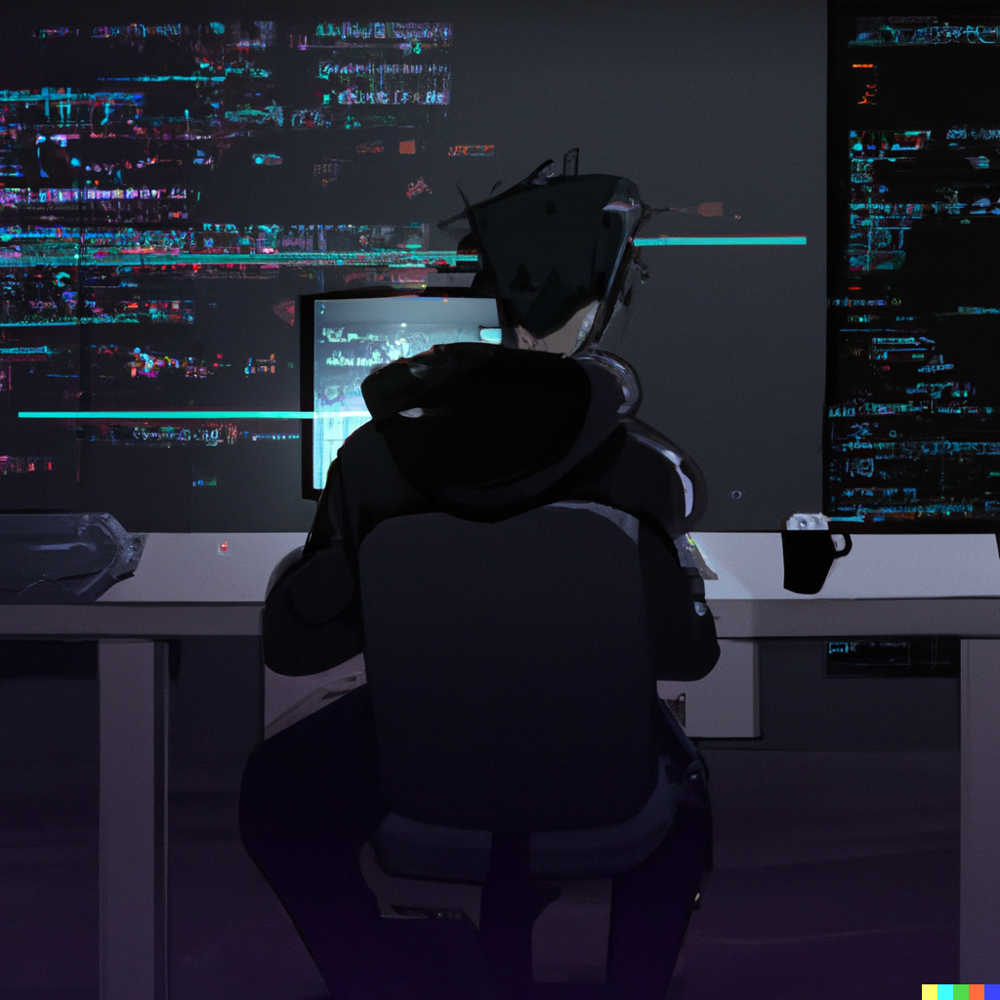

<h2 align="center"><b>What I hear, I forget. What I see, I remember. What I do, I understand.</b></h2>

  <picture>
    
  </picture>
  <picture>
    
  </picture>
  <picture>
    
  </picture>

<h2 align="center"><b>Metrics</b></h2>

  <picture>
    
  </picture>

  <picture>
    
  </picture>

  <picture>
    
  </picture>

<h3 align="center"><b>Contact</b></h3>

    <a href="https://github.com/TheWisker">
        </img>
    </a>

<code>TheWisker@protonmail.com</code>

<i>Love really dark coffee!</i>

